<h1 align="center"><b>Hi, I'm Nguyen Hoang Son </b></h1>
<!--  -->

  

  
  
  
  

	
## &nbsp;**About me**

 

I am a data enthusiast passionate about designing scalable ELT/ETL architectures. Beyond building pipelines, I love data modeling and unlocking insights that drive strategic decisions. I am always exploring new technologies to learn and grow in the data space. 

🚀 A passionate Data Engineer \
📚 Enjoying reading books and listening to music \
✍️ Currently learning Data Analytics & Analytics Engineer by Self \
💼 I’m currently open for an Intern or a new job opportunity ([My Resume](https://drive.google.com/file/d/1n-zEhz4oQzhW8psXQo4YOM1OOMQ3tFt0/view?usp=sharing))

 

## <b> Skills</b>
 

### 🧑‍💻 Programming & Query Languages
    

### 📥 Data Ingestion & Collection (DE/AE focus)

### 🔄 Transformation & Orchestration (AE focus)
   

### 🛢️ Data Platforms & Storage
  
  

### 📊 BI, Analytics & Visualization (DA/BI focus)
 

### 🧠 Collaboration & Tools
   

<!-- 

 
 

----- -->

 

## <b> Github Stats </b>
 

  

 
 
 

-----

❤️ Thank you for taking the time to read my github profile ❤️

<!--   -->

 
 
 

